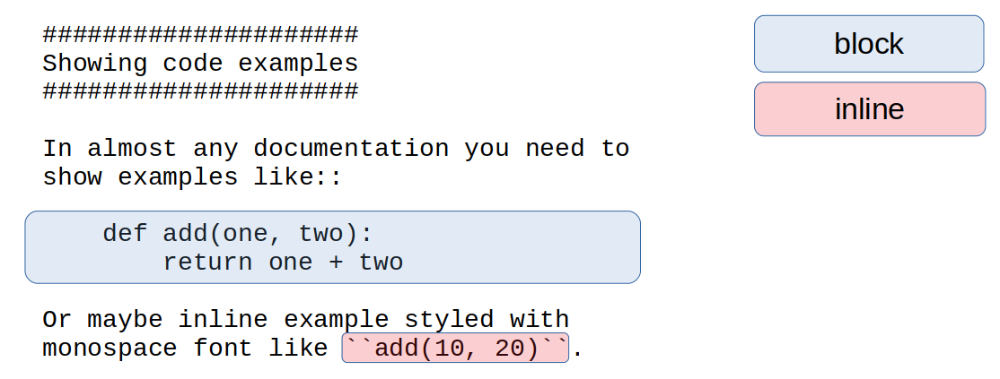

################################################################################
Code examples
################################################################################

.. sidebar:: Code example elements

   .. datatemplate:yaml:: /_data/collection/code-examples.yaml
      :template: collection.rst.jinja

In almost any technical documentation you need to show bits of code, filenames and paths, commands and console examples. They are usually styled in ``monospace font`` with optional syntax highlighting.

Block or inline level?
**********************

Before continuing, wait a second and thing if you want to show inline or block level code example. Even if you don't know syntax at this moment, you will understand the difference:

Theme author checklist
**********************

If you are developing Sphinx theme, ensure your theme behave properly to wrapping and line numbering long lines.

Code examples wrapping problem:

.. raw:: html

      <video controls width="100%">
           <source src="video/hard-wrapped-code-examples-problem.mp4" type="video/mp4">
      </video>

Code examples wrapping problem fixed:

.. raw:: html

      <video controls width="100%">
           <source src="video/hard-wrapped-code-examples-problem-fixed.mp4" type="video/mp4">
      </video>

Long line numbering problem:

.. image:: /img/linenos-styles-long-lines.png

