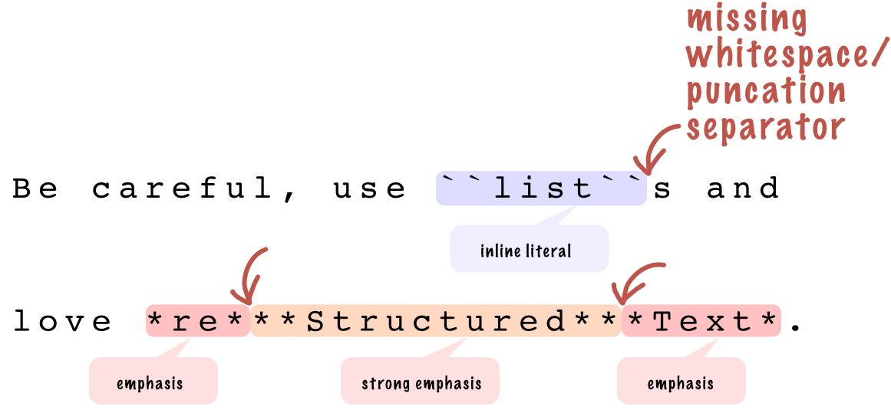

################################################################################
Inline elements
################################################################################
.. sidebar:: Inline elements

   .. datatemplate:yaml:: /_data/collection/inline-elements.yaml
      :template: collection.rst.jinja

Inline elements are part of the text line. They occupy only the space they need and they only may appear inside parent :doc:`body element </body-elements>` like paragraph, bullet list, table, etc.

Unfortunately, there are serious inline elements pitfalls, and it’s handy if you will know its limitations in advance.

Inline and block elements
*************************

It is very intuitive to differentiate between inline and block elements.

.. image:: /img/block-vs-inline-elements.png
   :width: 75%

.. _no-nested-inlines:

No inline element nesting
*************************

The annoying |rst|'s limitation is you can't nest the inline element into another, e.g. :doc:`/element/emphasis` (displayed as italic) inside :doc:`/element/strong-emphasis` (displayed as bold), substitution inside emphasis, etc. Unfortunately, there is no workaround.

.. image:: /img/no-nested-inlines.png
   :width: 75%

Some examples of inline markup nesting that *don't work*:

.. datatemplate:yaml:: /_data/snippet/no-nested-inlines.yaml
   :template: snippet.rst.jinja

No underline and colors
************************

Underline is not intentionally part of the |rst|. Professional docs, prose, and books almost never use underlines.

You can’t also intentionally "highlight" a text in certain color. Colors are representation, while |rst| describes text semantically (the meaning instead of appearance).

.. _inline-markup-recognition:

Requires whitespace or punctation around
****************************************

Any inline element must be precceded and succeeded by one or more whitespace (e.g., the space character) or punctation character (e.g., ``!``, ``?`` or ``.``). In other words: **an inline element needs to be separated from another one from both sides with whitespace or punctation, therefore two inline elements cannot be appear immediately succeeding**.

Choosing whitespace or puncation as a separator is clever. Usually you don't have to think of it. Most inline elements are naturally separated by the space, period, exlamation or question mark at the end of sentence.

However, there are edge cases. If you forgot this rule and place two adjecent inline elements without surrinding separator, they can't be properly recognized:

First line causes ``WARNING: Inline literal start-string without end-string.``. It is helpful. The second line is more tricky because doesn't generates a warning and :literal:`**re***Structured***Text*` is silently misinterpreted as one long emphasis word - strong emphasised :literal:`**Structured**` is not recognized!

.. datatemplate:yaml:: /_data/snippet/succeeding-inlines.yaml
   :template: snippet.rst.jinja

Fortunately, two inline elements without no whitespace/punctation in-between are possible with *escaping mechanism* using backslash-escaped whitespace (backslash is ``\``). Backslash-espaced whitespace will be removed from the output document.

Previous example fixed:

.. datatemplate:yaml:: /_data/snippet/succeeding-inlines-fixed.yaml
   :template: snippet.rst.jinja