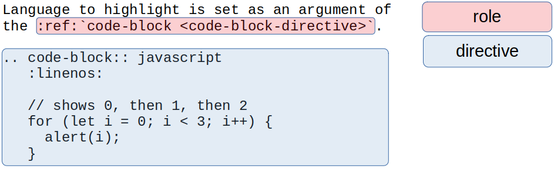
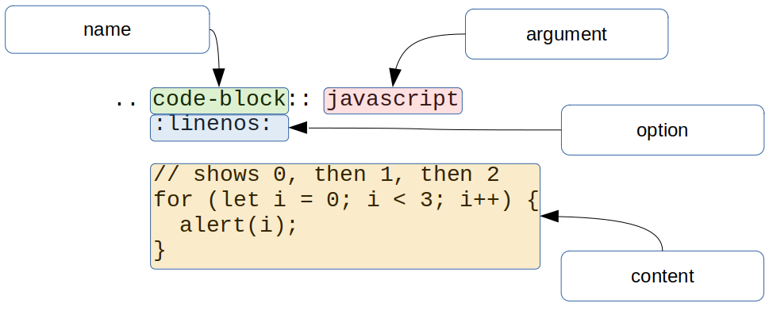
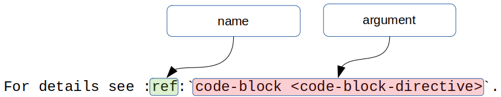

####################
Directives and roles
####################

|rst| and Sphinx essential knowledge is the understanding of directives and roles. They are syntactic constructions that can add new features to the |rst|.

* Directives are block elements. Begin with the :literal:`\.\.\ ` (two dots and one space), followed by a name, and ends with ``::``.
* Roles are inline elements. Role name is enclosed into ``:``.

For example, the following uses ``:ref:`` role and ``code-block::`` directive:



.. _directive-anatomy:

Directive anatomy
*****************

You need to grasp some terminology of |rst| directive anatomy - name, argument, options, and content:

* every directive begins on the new line with :literal:`\.\.\ ` (two dots and one space)
* follows the **directive name**
* after the name is ``::``
* if directive accepts **the argument**, they are after ``::``
* if directive accepts **the option(s)**, they are within ``:`` and each on a new line
* some of them takes the **option value** that follows the option name, e.g. ``::emphasize-lines: 2``
* if directive accepts **the content**, it is after a blank line

Everything above illustrated:



For example, the directive ``image::`` accepts a path to the file as the required argument, recognize few optional options like ``:width:`` and ``:class:``, and doesn't except any content:

.. datatemplate:yaml:: /_data/snippet/directive-example1.yaml
   :template: snippet.rst.jinja

.. _role-anatomy:

Role anatomy
************

Similarly, a role syntax has few terminology that is useful to know - role name and text:

* the **role name** is between ``:``
* anything within ````` is the **role text**

The above illustrated:



For example, the above used role ``:ref:`` is used to make a reference (link) to another place in the docs. This role text is ``code-block <code-block-directive>``. The text interpretation is up to the role. ``:ref:`` role creates a link ``code-block`` that will point to place labeled ``code-block-directive``.

.. datatemplate:yaml:: /_data/snippet/role-example1.yaml
   :template: snippet.rst.jinja

.. _role-escaping:

Role escaping
=============

Role text start-string and end-string is single backtick `````.

You have to care backslash-escapes in the role

 ``WARNING: Inline interpreted text or phrase reference start-string without end-string.``

.. datatemplate:yaml:: /_data/snippet/role-escaping1.yaml
   :template: snippet.rst.jinja

Above fixed:

.. datatemplate:yaml:: /_data/snippet/role-escaping2.yaml
   :template: snippet.rst.jinja

Extendability
*************

Why are directives and roles so important? They are an extension mechanism to bring the new feature without introducing a new syntax.

For example, very common ``:ref:`` role is actually added to the |rst| by Sphinx.

Another example - pure |rst| contains bullet lists that you saw above. But the Sphinx adds ``hlist::`` directive that creates horizontally distributed list:

.. datatemplate:yaml:: /_data/snippet/hlist.yaml
   :template: snippet.rst.jinja

Many third-party extensions to the Sphinx adds new roles and directives. You can develop your own directives and roles. This extensibility is definitively |rst|'s selling point - you are never limited in what the documentation will contain or appear. For example, you can develop an extension that lookup values or print tables from CSV files.